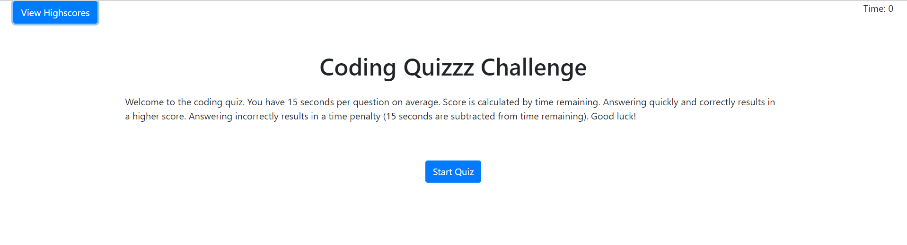

# Code-Quiz

A simple code-related quiz page.

The landing page contains two buttons: 
* View Highscores
* Start Quiz

"View Highscores" will take a user to the "Highscores" screen. If no highscores have been saved yet, the page will display corresponding alert. 

"Start Quiz" will start the quiz. Questions will appear one after another until all questions are done. Also, the timer will start (total time is calculated based of 15 seconds per question). The quicker the player answers the question, the more scores they will get for this question (score starts with 15 and goes down by 1 every second until it's 1). If the player answers the question incorrectly, 15 seconds will be taken off the total time.

Once the time runs out, or the player answers all the questions, the system will ask for players initials. Once the initials are submitted, they will be saved in the browser memory along with the total score.

Image of the app:

Link to app: 
https://volkir87.github.io/Code-Quiz